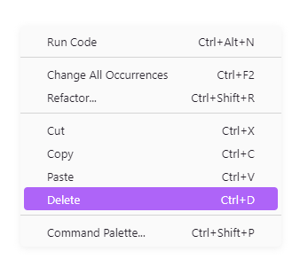

# CutCopyPasteDELETE 

Adds "Delete" command to the editor's right-click context menu. 

As a long time user of Notepad.exe I am used to right-clicking on text, and deleting it from the context menu. For some reason VS Code does not have the "Delete" command in the right-click context menu, so I made this. 

This extension has some some extra features other than deleting selected text. Read more on that in the *Extension Settings* section below. 

I hope you will find it useful. 

## Features 

Depending on how you configure it, this extension can do the following: 

    - Delete selected text 
    - Delete the underlying word, if no text selected 
        Delete line if the caret is placed at the end of the last character on the line 
    - Delete line if nothing is selected 
        Delete line / Empty line 
    - Trim whitespace left 
        Leave one space 
    - Trim whitespace right 
        Leave one space 

## Extension Settings 

This extension contributes the following settings: 

*Please restart Visual Studio Code for changes to take effect* 

- `cutCopyPasteDelete.deleteWordUnderTheCaret.enabled` 

    If enabled, you can right click on a word and click "Delete" to delete it, no need to select it first 

- `cutCopyPasteDelete.deleteWordUnderTheCaret.deleteLineWhenCaretAtEndOfLineCharacter.enabled` 

    This a modification to `deleteWordUnderTheCaret`. If enable it, when the caret is placed after the last character on the line, it will delete the whole line instead of the last word 

- `cutCopyPasteDelete.deleteLineIfNoSeletion.enabled` 

    If enabled, will delete the whole line when the caret is placed on whitespace. If `deleteWordUnderTheCaret` is disabled, will delete lines when right clicking on words too

- `cutCopyPasteDelete.deleteLineIfNoSeletion.emptyLine.enabled` 

    This is a modification to `deleteLineIfNoSeletion`. If enabled, empties the line instead of deleting it 

- `cutCopyPasteDelete.trim.left.enabled` 

    If enabled, will trim all whitespace to the left of the word or selected text 

- `cutCopyPasteDelete.trim.left.leaveOneSpace` 

    If enabled, will leave one whitespace after trimming to the left of the word or selected text 

- `cutCopyPasteDelete.trim.right.enabled` 

    If enabled, will trim all whitespace to the right of the word or selected text 

- `cutCopyPasteDelete.trim.right.leaveOneSpace` 

    If enabled, will leave one whitespace after trimming to the right of the word or selected text 

## Known Issues 

¯\\_(ツ)_/¯ you tell me ... 

## Release Notes 

### 1.0.0 

Initial release of CutCopyPasteDELETE 